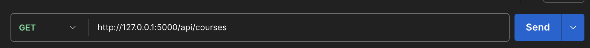
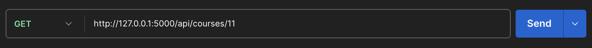
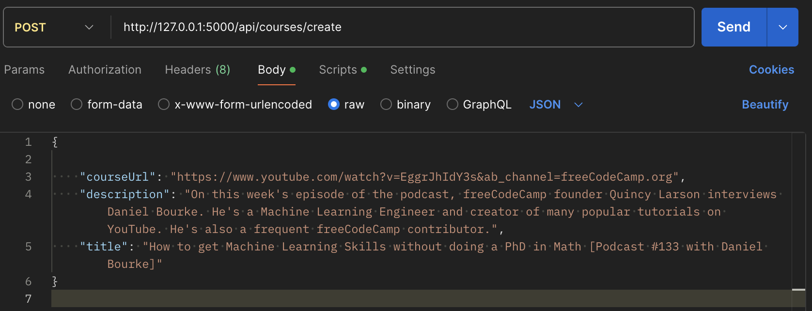
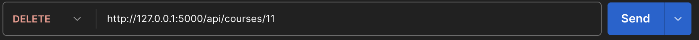
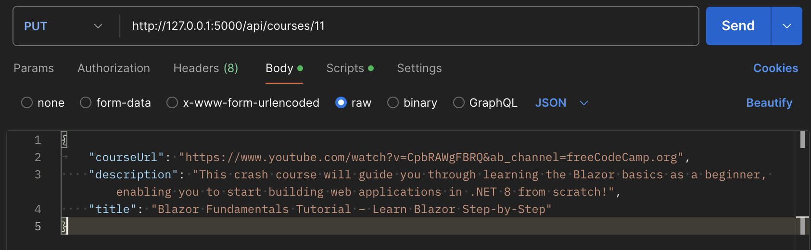

## RESTful API for courses on Youtube
>Learning to make API for MKSOL

# How to use this API?

Use each endpoint below to make requests to API.

# HTTP:

``Local Host: http://127.0.0.1:5000
 ``

# Types of requests


## GET request:
``/api/courses``

Use this endpoint to retrieve data for all courses in database.

### Example using Postman:



---

## GET request:
``/api/courses/<course_id>``

Use this endpoint to retrieve data for course with specified ID.

### Example using Postman:


---

## POST request:
``/api/courses/create``

Send JSON data to this endpoint to create a new course.

Format data as below:
```
{
  "courseUrl": str,
    "description": str,
    "title": str
}
```

### Example using Postman:



---

## DELETE request:
``/api/courses/<course_id>``

Provide an ID to this endpoint to delete a specific course

### Example using Postman:



---

## PUT request:
``/api/courses/<course_id>``

Send course data to this endpoint and provide ID to update an existing course

### Example using Postman:




